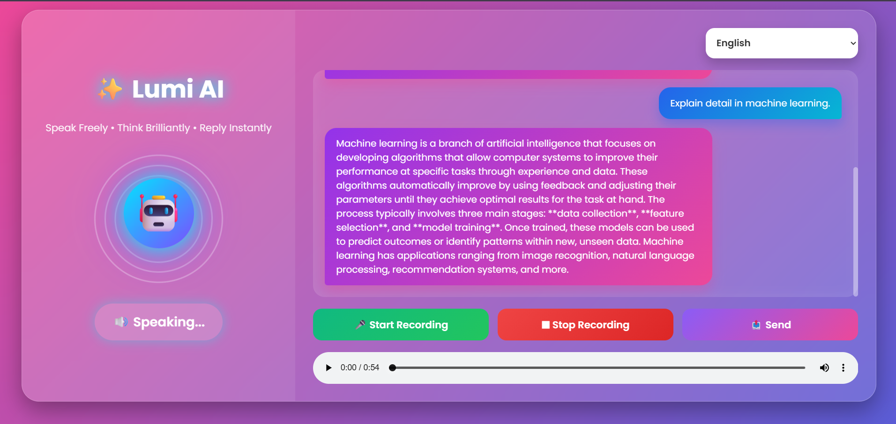

# 🤖 Lumi AI – Voice Chatbot
## 📸 Project Preview

Lumi AI is a voice-enabled AI chatbot built using Python in Google Colab. It integrates speech recognition, a Large Language Model from Hugging Face, and text-to-speech to create an interactive conversational experience.

## 🚀 Features

- 🎙️ Speech-to-Text using Faster-Whisper
- 🧠 AI responses using Hugging Face Qwen2.5-1.5B-Instruct
- 🔊 Text-to-Speech using gTTS
- 🌐 Flask-based web interface
- 💬 Interactive chatbot conversation

## 🛠️ Technologies Used

- Python
- Google Colab
- Hugging Face Transformers
- Qwen2.5-1.5B-Instruct
- Faster-Whisper
- Flask
- Flask-CORS
- gTTS
- Librosa
- NumPy

## 📂 Project

- `CHATBOT (2).ipynb` – Complete implementation of the AI voice chatbot.

## ▶️ How to Run

1. Open the notebook in Google Colab.
2. Install the required libraries.
3. Run all notebook cells.
4. Start the Flask server and interact with the chatbot.

## 📚 Purpose

This project demonstrates the integration of speech recognition, a Hugging Face Large Language Model, and speech synthesis to build an AI-powered voice chatbot.
